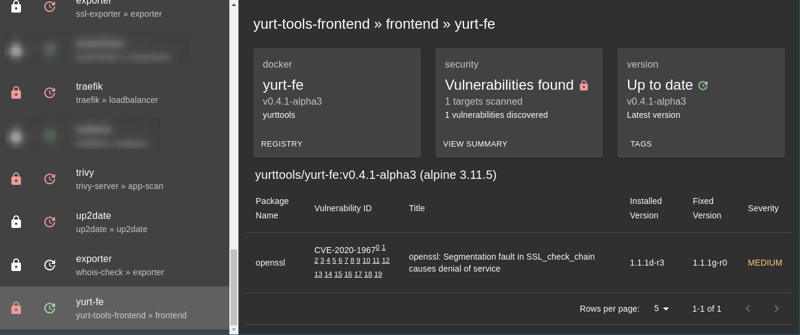

# yurt-tools

Yurt Tools is a collection of tools for your Nomad cluster.  This
contains things that shouldn't necessarily be built in to Nomad, but
are very useful to have.

The Yurt Tools web interface is an intuitive way to visualize data
about your cluster.  The data is in an easily digestable format and is
suitable for exporting into reports.

The yurt-tools system is made up of many tools, described in brief
below and in detail on the linked pages.

If you want to deploy the yurt-tools suite, you can find a sample set
of JobSpecs in the [nomad](nomad/) directory.

---

## [task-discover](cmd/task-discover/)

This tool scrapes the Nomad job list and populates a key structure in
Consul to allow other tools to fetch more detailed data on a job.

## [version-checker](cmd/version-checker/)

This tool searches for newer versions of a task's input image to see
if the latest version is running.

## [trivy-dispatch](cmd/trivy-dispatch/)

This tool runs parallel scans of your Docker images using the Trivy
security scanning tool.  These results are surfaced directly in the
web interface.

## [yurt-fe](cmd/yurt-fe/)

This is the main web frontend of the Yurt Tools suite.  This task must
be running if you want to get the human-readable outputs from the
system, but you can also parse the JSON tree from Consul directly to
pull the results into your own monitoring and reporting tools.

## [up2date](cmd/up2date/)

This is a legacy tool that helps you determine when tasks are out of
date.  Only use this if you have a good reason to avoid the full
yurt-tools suite, as you will get a better experience from the full
suite.
